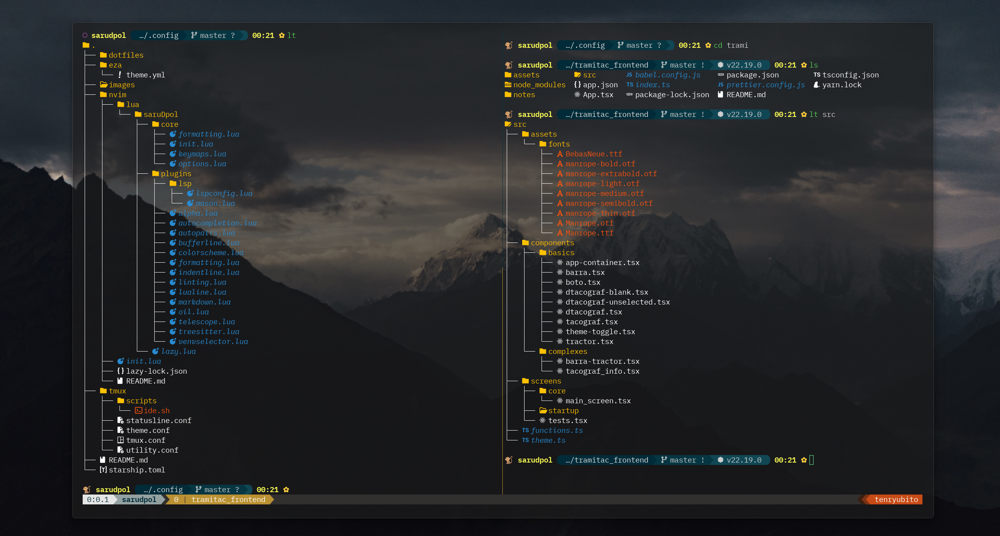
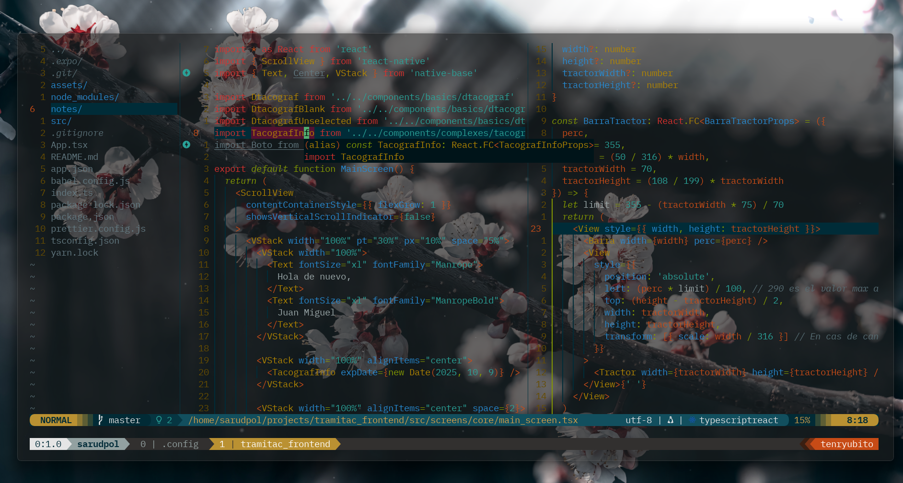

# 🏯🎋🎍🌸 saruDpol's dotfiles 🐒🥋🦧🦍

Config for:

- NVIM v0.12.0-dev
- Build type: RelWithDebInfo
- LuaJIT 2.1.1703358377
- Run "nvim -V1 -v" for more info

## Replication Notes

### WSL system dependencies

- `sudo apt update`
- `sudo apt install -y git curl build-essential unzip neovim ripgrep fd-find tmux lazygit eza zoxide zsh nodejs npm python3 python3-venv tree-sitter-cli`
- `sh -c "$(curl -fsSL https://raw.githubusercontent.com/ohmyzsh/ohmyzsh/master/tools/install.sh)"`
- `git clone https://github.com/zsh-users/zsh-autosuggestions ${ZSH_CUSTOM:-~/.oh-my-zsh/custom}/plugins/zsh-autosuggestions`
- `git clone https://github.com/zsh-users/zsh-syntax-highlighting ${ZSH_CUSTOM:-~/.oh-my-zsh/custom}/plugins/zsh-syntax-highlighting`
- `curl -fsSL https://starship.rs/install.sh | sh`

Notes:

- `build-essential` provides the C toolchain and `make` needed by native plugin builds.
- Ubuntu installs `fd-find` as `fdfind`.
- `tree-sitter-cli` is included because this setup leans heavily on Tree-sitter.
- WSL clipboard support in Neovim expects `clip.exe` and PowerShell to be available from Windows.

### Plugin versions

Exact Neovim plugin resolution is tracked in [`nvim/lazy-lock.json`](./nvim/lazy-lock.json). The main pinned plugins currently in use are:

- `folke/lazy.nvim` @ `306a05526ada86a7b30af95c5cc81ffba93fef97`
- `craftzdog/solarized-osaka.nvim` @ `f0c2f0ba0bd56108d53c9bfae4bb28ff6c67bbdb`
- `goolord/alpha-nvim` @ `a9d8fb72213c8b461e791409e7feabb74eb6ce73`
- `hrsh7th/nvim-cmp` @ `a1d504892f2bc56c2e79b65c6faded2fd21f3eca`
- `windwp/nvim-autopairs` @ `59bce2eef357189c3305e25bc6dd2d138c1683f5`
- `akinsho/bufferline.nvim` @ `655133c3b4c3e5e05ec549b9f8cc2894ac6f51b3`
- `stevearc/conform.nvim` @ `086a40dc7ed8242c03be9f47fbcee68699cc2395`
- `lukas-reineke/indent-blankline.nvim` @ `d28a3f70721c79e3c5f6693057ae929f3d9c0a03`
- `mfussenegger/nvim-lint` @ `4b03656c09c1561f89b6aa0665c15d292ba9499d`
- `hrsh7th/cmp-nvim-lsp` @ `cbc7b02bb99fae35cb42f514762b89b5126651ef`
- `williamboman/mason.nvim` @ `44d1e90e1f66e077268191e3ee9d2ac97cc18e65`
- `williamboman/mason-lspconfig.nvim` @ `25f609e7fca78af7cede4f9fa3af8a94b1c4950b`
- `WhoIsSethDaniel/mason-tool-installer.nvim` @ `443f1ef8b5e6bf47045cb2217b6f748a223cf7dc`
- `nvim-lualine/lualine.nvim` @ `47f91c416daef12db467145e16bed5bbfe00add8`
- `iamcco/markdown-preview.nvim` @ `a923f5fc5ba36a3b17e289dc35dc17f66d0548ee`
- `stevearc/oil.nvim` @ `0fcc83805ad11cf714a949c98c605ed717e0b83e`
- `sphamba/smear-cursor.nvim` @ `c85bdbb25db096fbcf616bc4e1357bd61fe2c199`
- `nvim-telescope/telescope.nvim` @ `cfb85dcf7f822b79224e9e6aef9e8c794211b20b`
- `nvim-telescope/telescope-fzf-native.nvim` @ `6fea601bd2b694c6f2ae08a6c6fab14930c60e2c`
- `nvim-telescope/telescope-file-browser.nvim` @ `3610dc7dc91f06aa98b11dca5cc30dfa98626b7e`
- `nvim-treesitter/nvim-treesitter` @ `81295eb0c5fc05ab3796a28c9f160c3ac4098106`
- `linux-cultist/venv-selector.nvim` @ `bcb2f58533c59b01565285eba49693f00bc460f5`

### Tmux plugin state

- `tmux-plugins/tpm` is configured in [`tmux/tmux.conf`](./tmux/tmux.conf) but is not pinned in this repo.
- To reproduce it, install TPM with:
  `git clone https://github.com/tmux-plugins/tpm ~/.config/tmux/plugins/tpm`
